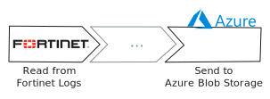

Parsing is now easier, faster, and better than before with [Tenzir Node
v4.21][github-release]. Also: introducing an all-new integration with Azure Blob
Storage.



[github-release]: https://github.com/tenzir/tenzir/releases/tag/v4.21.0

<!-- truncate -->

## Reading in Fortinet and Sophos logs

Tenzir now supports reading Fortinet and Sophos logs. This feature is powered
by an update to the KV-Parser, which has been upgraded to allow quoted values.
For example, here's how you can use the new parser to take apart a Fortinet
FortiGate log file:

```text {0} title="Parse a Fortinet log file"
from "fortinet.log" read kv
| parse rawdata kv "\|" "="
```

Using the above pipeline to parse an example file:

```text {0} title="fortinet.log"
logver=700120523 timestamp=1694183556 devname="HA-Cluster" devid="FG200E4Q1790000" vd="root" date=2023-09-08 time=14:32:36 eventtime=1694176357211540851 tz="+0200" logid="0317013312" type="utm" subtype="webfilter" eventtype="ftgd_allow" level="notice" policyid=2 poluuid="2b9647ee-70cb-51ed-d1c3-8e08a2e5fec0" policytype="proxy-policy" sessionid=2096597111 user="user1" group="group1" authserver="DC20" srcip=192.168.0.1 srcport=57642 srccountry="Reserved" srcintf="port1" srcintfrole="lan" dstip=1.2.3.4 dstport=443 dstcountry="Germany" dstintf="wan1" dstintfrole="wan" proto=6 service="HTTPS" hostname="www.example1.com" profile="REDACTED" action="passthrough" reqtype="referral" url="https://www.example1.com/" referralurl="https://www.example1.com/page" sentbyte=1713 rcvdbyte=238 direction="outgoing" msg="URL belongs to an allowed category in policy" method="domain" cat=75 catdesc="Internet Radio and TV" rawdata="Method=CONNECT|User-Agent=Mozilla/5.0 (Windows NT 10.0; Win64; x64) AppleWebKit/537.36 (KHTML, like Gecko) Chrome/116.0.0.0 Safari/537.36 Edg/116.0.1938.81"
```

```json {0} title="Output"
{
  "logver": 700120523,
  "timestamp": 1694183556,
  "devname": "HA-Cluster",
  // ...
  "catdesc": "Internet Radio and TV",
  "rawdata": {
    "Method": "CONNECT",
    "User-Agent": "Mozilla/5.0 (Windows NT 10.0; Win64; x64) AppleWebKit/537.36 (KHTML, like Gecko) Chrome/116.0.0.0 Safari/537.36 Edg/116.0.1938.81"
  }
}
```

## Parsing Improvements

We’ve made significant improvements to the accuracy of all parsers that deal
inputs of different schemas. Previously, parsers would often attempt to merge
input schemas, which could lead to additional null fields in the data. Now,
parsers strictly adhere to the input data. Basically, you now exactly get out
what you put in.

Alongside this, we also improved the user's control over the schema produced by the
parsers. For example, you can now give a `schema` to the `kv` parser, which gives
you the ability to specify the schema it should produce.

```text {0} title="Parse a Fortinet log file adhering to a manually specified schema"
from "fortinet.log" read kv --schema=my_schema
| parse rawdata kv "\|" "="
| …
```

You can find more information about these new options in [our
documentation](/next/formats#parser-schema-inference).

## Azure Blob Storage Integration

Tenzir now has an integration with Azure Blob Storage! This integration enables
users to securely load log files and export processed data back to Azure Blob
Storage, all while benefiting from both the flexibility and scalability of cloud
storage and the efficiency of Tenzir's data pipelines.

```text {0} title="Load 'suricata.json', authorized as 'tenzirdev'"
from "abfss://tenzirdev@container/suricata.json" read suricata
…
```

```text {0} title="Save events as csv to 'data.csv', authorized as 'tenzirdev'"
…
| to "abfss://tenzirdev@container/data.csv"
```

:::note Authenticate with the Azure CLI
Run `az login` on the command-line to authenticate the current user with Azure's
command-line arguments.
:::

## Other Changes

We have made great progress on TQL2 in the last month. A significant amount of
the language is already ported and a lot new and exciting functionality has been
implemented. You can expect the documentation to be available with the next
release.

This release additionally includes numerous small bug fixes and under-the-hood
improvements. For a detailed list of changes, be sure to check out the
[changelog][changelog].

## Join Us for Office Hours

Every second Tuesday at 5 PM CET, we hold our office hours on our
[Discord server][discord]. Whether you have ideas for new packages or want to
discuss upcoming features—join us for a chat!

[discord]: /discord
[changelog]: /changelog#v4210
