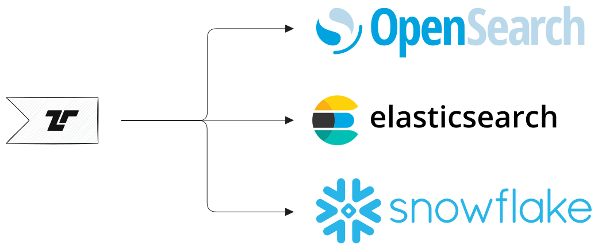

# Tenzir Node v4.25: Sinks Galore!

Tenzir Node v4.25 adds new sinks for Snowflake, OpenSearch, and Elasticsearch, allowing seamless data integration and output. It also introduces major enhancements to TQL2, including new language features and operator improvements.

[github-release]: https://github.com/tenzir/tenzir/releases/tag/v4.25.0

<!-- truncate -->

## New Sinks: Snowflake, OpenSearch, and Elasticsearch

Tenzir Node v4.25 offers several new sinks for sending your data. The [`to_snowflake`](/next/tql2/operators/to_snowflake) sink enables seamless writing of data into
[Snowflake](https://www.snowflake.com) databases, helping users integrate Tenzir with one of the most popular cloud data platforms. Additionally, the
new [`to_opensearch`](/next/tql2/operators/to_opensearch) and [`to_elasticsearch`](/next/tql2/operators/to_elasticsearch) sink operators allow direct data output to
[OpenSearch](https://opensearch.org/) and [Elasticsearch](https://www.elastic.co/elasticsearch), two powerful search and analytics engines.

For more information on using Tenzir in combination with these new sinks, check out our integration pages for [OpenSearch](/next/integrations/opensearch), 
[ElasticSearch](/next/integrations/elasticsearch) and [Snowflake](/next/integrations/snowflake)

## TQL2

We continue to enhance TQL2, moving closer to making it the default language for writing pipelines. This release adds numerous improvements and new features to expand TQL2's capabilities.

To simplify TQL2 adoption, we introduced a TQL2-only mode. When you enable this mode, all pipelines run in TQL2, and the Explorer interface automatically selects TQL2 mode. To enable it, set `TENZIR_TQL2=true` in your environment, configure `tenzir.tql2: true` in your settings, or start the node with `tenzir-node --tql2`.

### From and To

With the [`from`](/next/tql2/operators/from) and [`to`](/next/tql2/operators/to) operators, we have ported one of the last major functionalities from TQL1 to TQL2.

The [`from`](/next/tql2/operators/from) operator lets you onboard data from most sources effortlessly. For example, you can write `from "https://example.com/file.json.gz"` to automatically determine the load operator, compression, and format.

Conversely, the [`to`](/next/tql2/operators/to) operator makes it easy to send data to most destinations. For instance, you can write `to "ftps://example.com/file.json.gz"` to automatically determine the save operator, compression, and format.

### IPs and Timestamps

We improved support for working with the native IP and timestamp types in TQL2.

The `in` operator now checks IP or subnet data for subnet membership. For example, to check whether an IP address belongs to a subnet, use an expression like `1.2.3.4 in 1.2.0.0/16`. Similarly, to verify whether a subnet includes another subnet, write `1.2.0.0/16 in 1.0.0.0/8`. A new function, [`subnet(string)`](/next/tql2/functions/subnet), lets you parse strings as subnets.

To streamline time-related computations, we added the [`from_epoch(x:duration) -> time`](/next/tql2/functions/from_epoch) function (#4854), which converts durations to epoch times. Additionally, you can now convert strings to durations with the [`duration(string)`](/next/tql2/functions/duration) function.

### Operator Updates

We introduced significant updates to some TQL2 operators.

The HTTP operators now include several new options. The [`load_http`](/next/tql2/operators/load_http) operator supports options like `data`, `json`, `form`, `skip_peer_verification`, `skip_hostname_verification`, `chunked`, and `multipart`. The `skip_peer_verification` and `skip_hostname_verification` options are also available for the [`save_http`](/next/tql2/operators/save_http) operator.

We split the previously combined compress and decompress functionality into separate operators for Brotli and Gzip, giving users more granular control over compression tasks. The [`compress_gzip`](/next/tql2/operators/compress_gzip) and [`decompress_gzip`](/next/tql2/operators/decompress_gzip) operators now offer additional options, such as `compress_gzip level=10, format="deflate"`.

Finally, we renamed the TQL2 NICs operator from [`nic`](/next/tql2/operators/nic) to [`nics`](/next/tql2/operators/nics) to align with its documentation and maintain consistency.

## Bugfixes

This release also includes several important bug fixes. Highlights include:

- Resolved a parsing error with operator parenthesis continuation to ensure proper evaluation of expressions like `where (x or y) and z`.
- Fixed issues with handling empty records in `write_parquet`, enhancing compatibility with Parquet’s limitations.
- Prevented skipping required positional arguments in the argument parser to ensure robust script execution.

Check the [changelog][changelog] for the complete list.

## Let's Connect!

We’re excited to engage with our community! Join us every second Tuesday at 5 PM CET for office hours on [Discord][discord]. Share your ideas, preview upcoming features, or chat with fellow Tenzir users and our team. Bring your questions, use cases, or just stop by to say hello!

[discord]: /discord  
[changelog]: /changelog#v4250  
