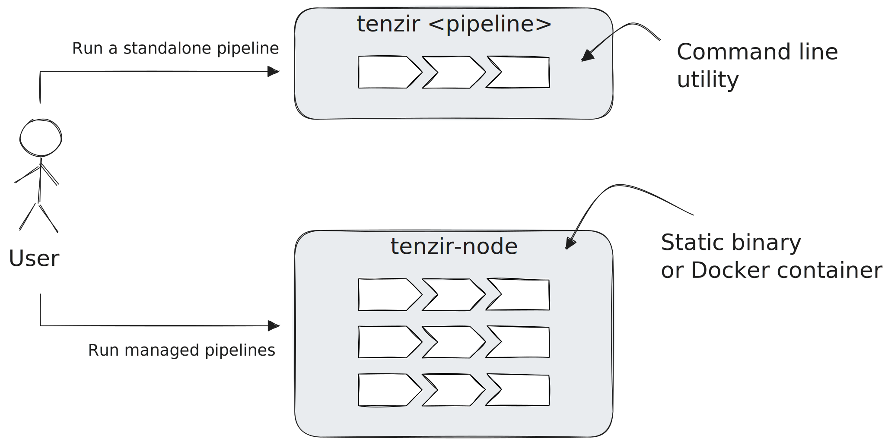
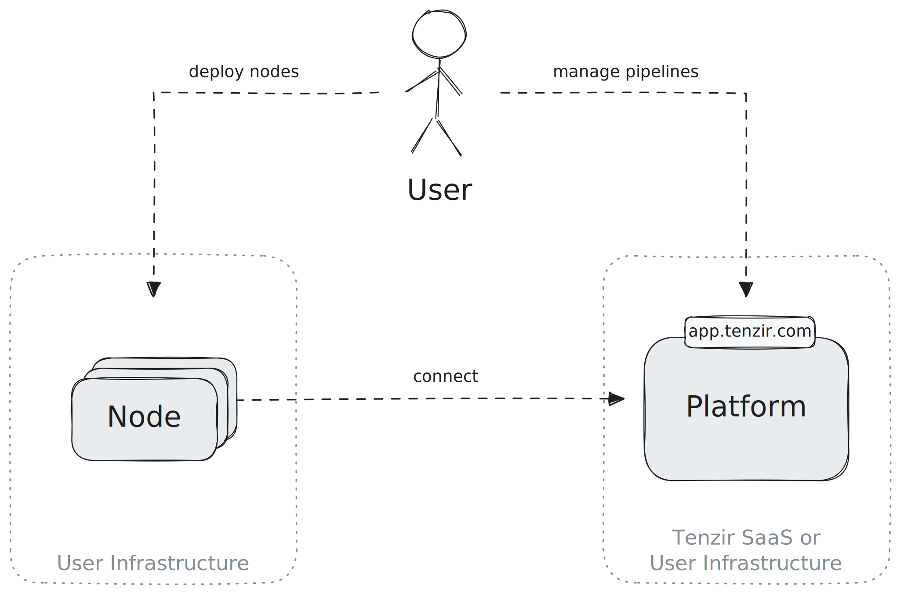

# How Does Tenzir Work?

Do you wonder how Tenzir works? What are the moving parts and key abstractions?
To answer these questions, let's begin with recap'ing central
[terms](../glossary.md) in the Tenzir ecosystem:

- **Pipeline**: A sequence of operators to load, parse, transform, and route
  data.
- **Node**: A process that manages pipelines.
- **Platform**: A management layer for a set of nodes.

## Standalone and Managed Pipelines

As a user, you would like to run pipelines. That's what brings the value. There
are two ways to do this:

1. Run a pipeline standalone on the command line with the `tenzir` binary.
2. Manage pipelines in a node that you start as Docker container or simply with
   the `tenzir-node` binary.

Running a standalone pipeline is useful when you are in front of the terminal
and want to transform data. Think `jq`, but generalized to arbitrary data and
input. Managing pipelines in a node is useful for long-running dataflows, but
it's equally possible to deploy pipelines that finish in a short amount of time.

## Nodes Connecting to the Platform

When you deploy a node, it attempts to connect to the platform. This makes it
easy to use the platform's web interface to test and deploy pipelines. The
platform is optional, though. You can also use the node's API to manage
pipelines CRUD-style.

However, the platform provides additional functionality for user and workspace
management. It is the component where authentication happens and where you bring
your identity provider (IdP). The platform also stores dashboards, which include
freely arrangeable cells of charts, also rendered by pipelines.

## Implementing Use Cases with Pipelines

Whether you use the command line or managed pipelines, the pipelines are your
working muscles that perform the actual work. There are several [use
cases](../use-cases.md) where Tenzir shines, ranging from cost optimization to
building a security data lake.

Many pipelines follow the same pattern: onboard data in different shapes,
normalize into a common schema, such as [OCSF](https://github.com/ocsf), enrich
the events, and finally route them to their destination.

Performing these individual steps is a often a matter of combining multiple
pipelines to create powerful data fabrics. For example, a frequently scenario
we encounter is *split-routing*: partitioning a dataflow into a contextualized,
actionable part sent to the SIEM, and high-volume low-fidelity part stored in
cheap long-term storage.

Now go build your own!
