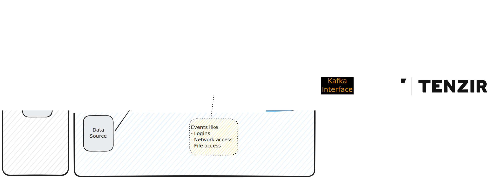

# Microsoft Defender Event Streaming

Microsoft Defender for Cloud provides security management and threat protection for various resources. For example, Microsoft Defender for Identity can be used to identify, detect, and investigate advanced threats, compromised identities, and malicious insider actions in Active Directory.

By integrating with Azure Event Hubs, Microsoft Defender can stream security events in real-time to various downstream systems for further analysis. With Tenzir, you can ingest these events, perform real-time analysis, and correlate them to gain comprehensive insights into potential threats and vulnerabilities.



:::tip Microsoft Defender Setup
The following example assumes that you have already set up Microsoft Defender and Microsoft Defender XDR, for example, by following the [official
documentation](https://learn.microsoft.com/en-us/azure/defender-for-cloud/connect-azure-subscription).
:::

## Requirements and Setup

### Azure

To stream security events from Microsoft Defender, an Azure Event Hub is used. It doesn't require any special configuration, but needs to be at least `Standard` tier to provide a Kafka endpoint. To verify, check if `Kafka Surface` is enabled after setting it up.

### Microsoft Security Center

In Microsoft Security Center, Streaming can be configured under `System -> Settings -> Microsoft Defender XDR -> General -> Streaming API`. Add a new Streaming API for the target Event Hub and enable all event types that you want to collect.

## Read events with a Tenzir pipeline

You can process the configured events with the following pipeline. Replace all strings starting with `YOUR_`. The configuration values can be found in Azure under `Event Hub Namespace -> Settings -> Shared access policies -> (Your policy)`.

```tql
// tql2
load_kafka topic="YOUR_EVENT_HUB_NAME", options = {
  "bootstrap.servers": "YOUR_EVENT_HUB_NAME.servicebus.windows.net:9093",
  "security.protocol": "SASL_SSL",
  "sasl.mechanism": "PLAIN",
  "sasl.username": "$ConnectionString",
  "sasl.password": "YOUR_CONNECTION_STRING" // Connection string-primary key
}
read_json
```

Example pipeline:

```tql
// tql2
load_kafka topic="tenzir-defender-event-hub", options = {
  "bootstrap.servers": "tenzir-defender-event-hub.servicebus.windows.net:9093",
  "security.protocol": "SASL_SSL",
  "sasl.mechanism": "PLAIN",
  "sasl.username": "$ConnectionString",
  "sasl.password": "Endpoint=sb://tenzir-defender-event-hub.servicebus.windows.net/;SharedAccessKeyName=RootManageSharedAccessKey;SharedAccessKey=SECRET123456"
}
read_json
```

Example event:

```json
{
  "records": [
    {
      "time": "2024-12-04T13:38:20.360851",
      "tenantId": "40431729-d276-4582-abb4-01e21c8b58fe",
      "operationName": "Publish",
      "category": "AdvancedHunting-IdentityLogonEvents",
      "_TimeReceivedBySvc": "2024-12-04T13:36:26.632556",
      "properties": {
        "ActionType": "LogonFailed",
        "LogonType": "Failed logon",
        "Protocol": "Ntlm",
        "AccountDisplayName": null,
        "AccountUpn": null,
        "AccountName": "elias",
        "AccountDomain": "tenzir.com",
        "AccountSid": null,
        "AccountObjectId": null,
        "IPAddress": null,
        "Location": null,
        "DeviceName": "WIN-P3MCS4024KP",
        "OSPlatform": null,
        "DeviceType": null,
        "ISP": null,
        "DestinationDeviceName": "ad-test.tenzir.com",
        "TargetDeviceName": null,
        "FailureReason": "UnknownUser",
        "Port": null,
        "DestinationPort": null,
        "DestinationIPAddress": null,
        "TargetAccountDisplayName": null,
        "AdditionalFields": {
          "Count": "1",
          "Category": "Initial Access",
          "AttackTechniques": "Valid Accounts (T1078), Domain Accounts (T1078.002)",
          "SourceAccountName": "tenzir.com\\elias",
          "SourceComputerOperatingSystemType": "unknown",
          "DestinationComputerObjectGuid": "793e9b90-9eef-4620-aaa2-442a22f81321",
          "DestinationComputerOperatingSystem": "windows server 2022 datacenter",
          "DestinationComputerOperatingSystemVersion": "10.0 (20348)",
          "DestinationComputerOperatingSystemType": "windows",
          "SourceComputerId": "computer win-p3mcs4024kp",
          "FROM.DEVICE": "WIN-P3MCS4024KP",
          "TO.DEVICE": "ad-test",
          "ACTOR.DEVICE": ""
        },
        "ReportId": "3d359b95-f8d5-4dbd-a64b-7327c92d32f1",
        "Timestamp": "2024-12-04T13:33:19.801823",
        "Application": "Active Directory"
      },
      "Tenant": "DefaultTenant"
    }
  ]
}
```
