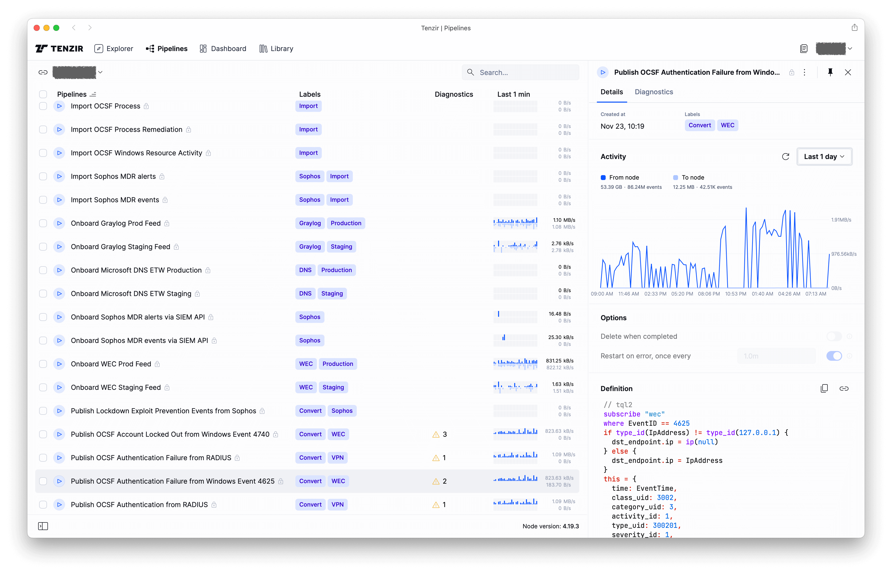
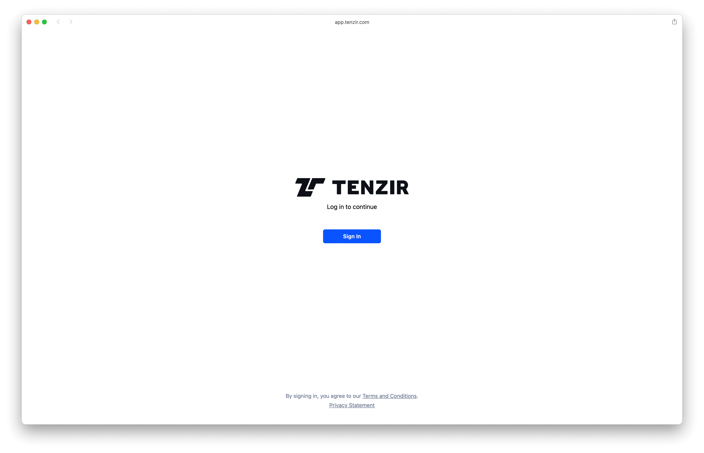
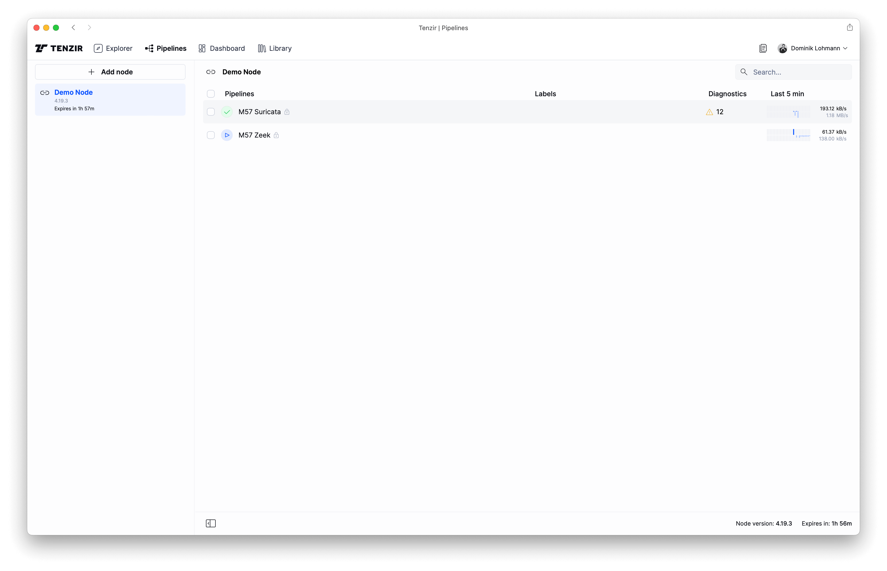
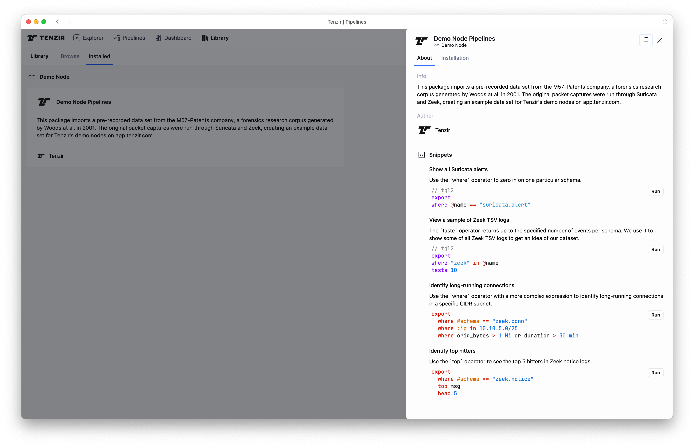

# Quickstart

Get up and running quickly with this tutorial. It just takes a few steps to run
pipelines.

## Explore the demo node

The easiest way to get started with Tenzir is using our cloud demo setup:

1. [Create a free account](installation/create-an-account.md) by signing in:

2. You will be redirected to the [Pipelines](https://app.tenzir.com/pipelines)
   page:

3. Create a demo node by clicking the *Add node* button in the left pane and
   select *Cloud-hosted demo node*. The demo node takes 1-2 minutes to boot up:

4. The demo node comes with the *Demo Node Pipelines* package from the library
   pre-installed. Head over to the *Library* page to view the installed package:

5. Let's run one of the snippets included with the demo package. This brings you
   right into the *Explorer*, where you can interactively run pipelines:

6. Start [learning TQL](language.md) and explore the data set visually, e.g.,
   by running aggregations and [plotting data](operators/chart.md):

## Up next

Now that you got a first impression of Tenzir, [onboard your own
node](installation/deploy-a-node.md) and dive deeper by

- following the [user guides](installation.md) with step-by-step tutorials of
  common use cases,
- learning more about the [language](language.md), [operators](operators.md),
  [connectors](connectors.md), [formats](formats.md), the [data
  model](data-model.md), and
- understanding [why](why-tenzir.md) we built Tenzir and how it compares to
  other systems.

Don't forget that we're here to help! If you have any questions, swing by our
friendly [community Discord](/discord) or open a [GitHub
discussion](https://github.com/tenzir/tenzir/discussions).
